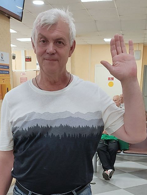

# **Моё портфолио**

 | Здравствуйте! Меня зовут Олег Гречишников. Я разработчик Web-приложений из Нижнего Новгорода. Моя специализация: разработка Web-приложений на React и Laravel. Я прошел обучение по професии "Веб разработчик с нуля" в университете [Нетология](https://netology.ru/).
-------------|----------------   

## Портфолио и сертификаты

Все мои работы и сертификаты Вы увидите в моем [портфолио]( https://gronickwork.github.io/PortfolioGronik/) 

## Контакты
Со мной можно связаться по почте: gronweb@yandex.ru  
по телефону: +7 906 364 30 28  
или в соцсетях: 
 |  |  |  | 
---------|---------|---------|---------|---------

Портфолио будет поплнятся по мере приоретения мной новых знаний и навыков.
